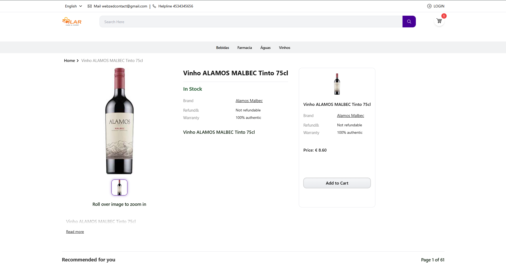
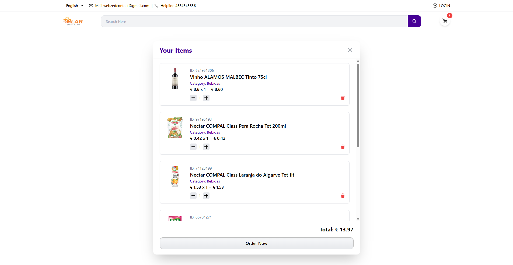

# ⚡ Esproforce Chip Project

A modern eCommerce-like project built with **React, TypeScript, TailwindCSS, Redux Toolkit**.  
It includes category filtering, cart system, authentication, and responsive UI.

---

## 🌐 Live Demo
🔗 [Visit the Project](https://sprwforge-online-shopping-project.vercel.app/)

---

## 🚀 Features
- 🔍 Category-based product filtering  
- 🛒 Add to Cart with Toast notification 
- 🎨 Responsive UI with TailwindCSS  
- ⚡ Fast build using Vite + TypeScript  

---

## 🛠️ Tech Stack
- ⚛️ React (Vite + TypeScript)  
- 🎨 Tailwind CSS  
- 🔄 Redux Toolkit  
- 📦 React Query  

---

## ⚙️ Installation

1. **Clone the repository**
   ```bash
   git clone https://github.com/yourusername/esproforce-chip.git


### 🏠 Home Page


### 🛒 Details Page


### 🛒 Cart Page


